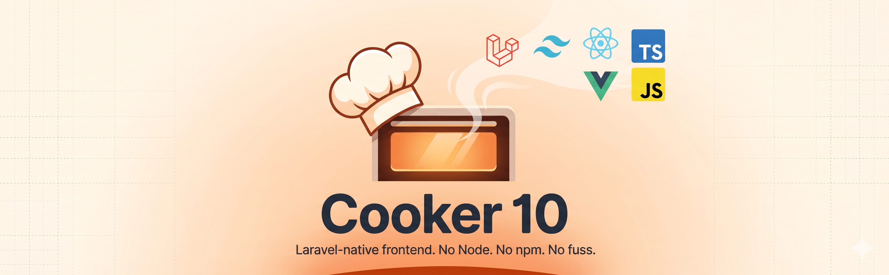

<p align="center">
    
</p>

<p>
Cooker is the Laravel-native frontend toolkit. It gives you Tailwind, React, Vue, TypeScript and JSX/TSX bundling — all driven from <code>php artisan</code>, with no Node, no <code>npm</code>, no <code>node_modules</code> and no <code>package-lock.json</code> in your project.
</p>

<p>
Cooker auto-downloads the binaries it needs (<code>esbuild</code>, <code>tailwindcss</code>) into <code>.cooker/bin</code>. npm packages are fetched directly from the registry and stored flat in <code>.cooker/packages</code>. Built assets are written to <code>public/build</code> as static files with hashed names.
</p>

***

## Table of contents

- [Why Cooker?](#why-cooker)
- [Requirements](#requirements)
- [Installation](#installation)
- [Concepts](#concepts)
- [Adding a stack](#adding-a-stack)
- [Adding npm packages](#adding-npm-packages)
- [The `@cooker` directive](#the-cooker-directive)
- [Building & watching](#building--watching)
- [Configuration](#configuration)
- [Upgrading from Cooker 8](#upgrading-from-cooker-8)

***

## Why Cooker?

If you've worked with Laravel + Vite or Laravel Mix you'll be familiar with the Node-shaped hole in your project: a `package.json`, a giant `node_modules`, a lockfile, and a separate dev server. Cooker replaces all of that with one Composer package and a small workspace folder.

- **No Node required.** Cooker drives `esbuild` and `tailwindcss` as standalone binaries.
- **No `node_modules`.** Packages live flat at `.cooker/packages/<name>/`. Cooker resolves transitive deps for you.
- **One command to install a stack.** `php artisan cooker:add react` installs React + ReactDOM and scaffolds a working `App.jsx`.
- **Beginner-friendly defaults.** `@cooker('app.js')` and `@cooker('app.css')` Just Work.
- **Static assets in production.** No PHP runtime asset routes — `public/build/*.js` is served by your web server like any other static file.

## Requirements

- PHP **>= 8.3**
- Laravel 10 or newer
- ext-zlib, ext-phar, ext-json (standard with most PHP builds)

## Installation

```bash
composer require genericmilk/cooker
php artisan cooker:install
```

The installer will:

1. Publish `config/cooker.php`.
2. Create `.cooker/` (bin, cache, packages) and add it to `.gitignore`.
3. Scaffold starter recipes at `resources/js/app.js` and `resources/css/app.css`.
4. Download `esbuild` for your platform.
5. Optionally bootstrap a stack (`react`, `vue`, `tailwind`).

After install, drop into a Blade view:

```blade
<head>
    @cooker('app.css')
</head>
<body>
    <div id="app"></div>
    @cooker('app.js')
</body>
```

Then build:

```bash
php artisan cooker:cook        # production build
php artisan cooker:watch       # dev — rebuilds on save
```

## Concepts

### Recipes

A **recipe** maps an output filename to a single entry file. Configured in `config/cooker.php`:

```php
'recipes' => [
    'app.js'  => 'resources/js/app.js',
    'app.css' => 'resources/css/app.css',
],
```

The output filename's extension determines the loader (`.js`/`.mjs` → script, `.css` → stylesheet). The entry's extension determines parsing — Cooker handles `.js`, `.ts`, `.jsx`, `.tsx`, `.mjs`, `.css`, `.less`, and `.scss`.

You import other files normally inside the entry — Cooker bundles them with esbuild.

### The `.cooker/` workspace

```
.cooker/
├── bin/              ← auto-downloaded binaries (esbuild, tailwindcss)
├── cache/            ← intermediate compiled CSS, etc.
├── packages/         ← flat npm package extracts
└── cooker.json       ← installed packages + active stacks
```

`.cooker/cooker.json` is your project's manifest — it's the only file inside `.cooker/` that's checked into git.

## Adding a stack

Stacks are opinionated bundles — they install the right packages, scaffold a working starter, and wire everything in.

```bash
php artisan cooker:add react        # React 18 + scaffolded App.jsx
php artisan cooker:add vue          # Vue 3 + scaffolded App.js
php artisan cooker:add tailwind     # Tailwind 4 — adds @import "tailwindcss"
```

After `cooker:add react`:

```
resources/js/
├── app.jsx                  ← entry; mounts <App/> to #app
└── components/App.jsx       ← starter component
```

Update `config/cooker.php` to point the recipe at `app.jsx`:

```php
'recipes' => [
    'app.js' => 'resources/js/app.jsx',
],
```

## Adding npm packages

```bash
php artisan cooker:add lodash
php artisan cooker:add @floating-ui/dom@^1
php artisan cooker:add zod@latest
```

Cooker fetches the tarball straight from the npm registry, extracts it to `.cooker/packages/<name>/` and resolves transitive dependencies. There's no `package.json` and no lockfile — `cooker.json` records the top-level packages you asked for.

In your code:

```js
import _ from 'lodash';
import { z } from 'zod';
```

Remove with:

```bash
php artisan cooker:remove lodash
```

## The `@cooker` directive

```blade
@cooker('app.css')
@cooker('app.js')
```

Reads `public/build/manifest.json` and emits the right tag with the hashed filename:

```html
<link rel="stylesheet" href="/build/app-3f8a91c2bd.css">
<script type="module" src="/build/app-7c0b1bf9aa.js"></script>
```

If a build hasn't been produced for the recipe yet, Cooker emits an HTML comment telling you to run `cooker:cook`.

## Building & watching

```bash
php artisan cooker:cook                    # production build, minified
php artisan cooker:cook --no-minify        # disable minification
php artisan cooker:cook --sourcemap        # emit sourcemaps
php artisan cooker:cook --clean            # wipe public/build first
php artisan cooker:watch                   # dev — incremental rebuilds on file change
php artisan cooker:watch --no-hmr          # disable live reload
```

In `app.debug=true` environments, `cooker:cook` defaults to non-minified + sourcemaps. In production, it minifies and skips sourcemaps. Override per-environment with `COOKER_MINIFY` and `COOKER_SOURCEMAP` env vars.

## Live reload

`cooker:watch` runs an embedded SSE server (default `127.0.0.1:5173`) and the `@cooker` directive injects a tiny client snippet into your pages — but **only when `APP_DEBUG=true`**.

- **CSS-only changes** hot-swap the matching `<link>` tag, no full reload.
- **JS or mixed changes** trigger `location.reload()`.
- The client auto-reconnects if the watcher restarts.

Configure host/port in `config/cooker.php` under `dev`, or via `COOKER_DEV_HOST` / `COOKER_DEV_PORT`. Disable entirely with `COOKER_DEV_ENABLED=false` or `--no-hmr`.

## Configuration

`config/cooker.php` is short on purpose:

```php
return [
    'recipes' => [
        'app.js'  => 'resources/js/app.js',
        'app.css' => 'resources/css/app.css',
    ],
    'output' => [
        'path' => 'public/build',
        'url'  => '/build',
    ],
    'toolbox' => [
        'path'     => '.cooker/bin',
        'esbuild'  => '0.24.2',
        'tailwind' => '4.0.0',
    ],
    'packages' => [
        'path'     => '.cooker/packages',
        'manifest' => '.cooker/cooker.json',
        'registry' => env('COOKER_REGISTRY', 'https://registry.npmjs.org'),
    ],
    'build' => [
        'minify'    => env('COOKER_MINIFY', null),
        'sourcemap' => env('COOKER_SOURCEMAP', null),
        'target'    => env('COOKER_TARGET', 'es2020'),
    ],
];
```

## Upgrading from Cooker 8

Cooker 10 is a clean rewrite. The runtime PHP asset server (`__cooker/{file}`), `Ovens`, `Preparsers` and the `import name from 'name'` rewrite-to-CDN behaviour are all gone. To upgrade:

1. `composer require genericmilk/cooker:^10`
2. `php artisan cooker:uninstall` (in your old project) or delete `config/cooker.php` and `.cooker/` manually.
3. `php artisan cooker:install`.
4. Move your hand-written code into the new `resources/js/app.js` / `resources/css/app.css` entry files and add real `import` statements.
5. Replace any old `cooker-toolbelt` / `cooker-routes` imports — they're not part of Cooker 10.
6. For each npm package you used to import directly from `esm.run`, run `php artisan cooker:add <name>`.

## License

MIT — see [LICENSE](LICENSE).
